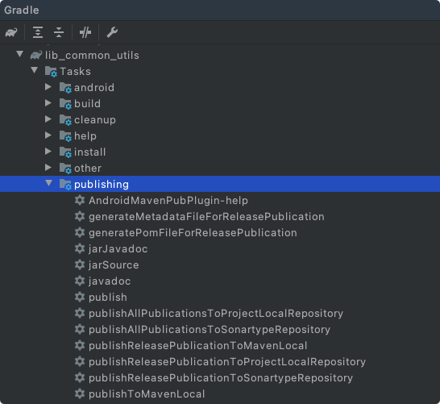

# AndroidMavenPubPlugin 使用说明

## 插件用途

本插件用于简化Android库上传到Maven中心仓库的配置，避免每个project的gradle中都放置一份重复较多的配置；

插件有如下功能：
1. 简化 maven-publish 插件的配置流程；
2. 添加上传到Maven中心仓库的 publish 任务；
3. 支持配置上传时是否包含 javadoc 及源码；

### 直接使用maven-publish插件的配置：

```kotlin
import org.gradle.api.publish.maven.MavenPom

plugins {
    id("com.android.library")
    id("signing")
    `maven-publish`
}

android {
    defaultConfig {
        versionName("1.0.0-SNAPSHOT")
    }
}

dependencies {
   // 
}

tasks.register("javadoc", Javadoc::class.java) {
    group = "publishing"
    dependsOn("assemble")
    source = android.sourceSets["main"].java.getSourceFiles()
    classpath += project.files(android.bootClasspath + File.pathSeparator)
    if (JavaVersion.current().isJava9Compatible) {
        (options as StandardJavadocDocletOptions).addBooleanOption("html5", true)
    }
    android.libraryVariants.forEach { libraryVariant ->
        classpath += libraryVariant.javaCompileProvider.get().classpath
    }
    options.apply {
        encoding("UTF-8")
        charset("UTF-8")
        isFailOnError = false

        (this as StandardJavadocDocletOptions).apply {
//            addStringOption("Xdoclint:none")
            links?.add("https://developer.android.google.cn/reference/")
            links?.add("http://docs.oracle.com/javase/8/docs/api/")
        }
    }
}

tasks.register("jarSource", Jar::class.java) {
    group = "publishing"
    from(android.sourceSets["main"].java.srcDirs)
    archiveClassifier.set("sources")
}

tasks.register("jarJavadoc", Jar::class.java) {
    group = "publishing"
    dependsOn("javadoc")
    val javadoc: Javadoc = tasks.getByName("javadoc") as Javadoc
    from(javadoc.destinationDir)
    archiveClassifier.set("javadoc")
}

fun getMyPom(): Action<in MavenPom> {
    return Action<MavenPom> {
        name.set("Android Common Utils Lib")
        description.set("Android Common Utils Library For HJ")
        url.set("https://github.com/hanlyjiang/lib_common_utils")
        licenses {
            license {
                name.set("The Apache License, Version 2.0")
                url.set("http://www.apache.org/licenses/LICENSE-2.0.txt")
            }
        }
        developers {
            developer {
                id.set("hanlyjiang")
                name.set("Hanly Jiang")
                email.set("hanlyjiang@outlook.com")
            }
        }
        scm {
            connection.set("scm:git:git://github.com/hanlyjiang/lib_common_utils.git")
            developerConnection.set("scm:git:ssh://github.com/hanlyjiang/lib_common_utils.git")
            url.set("https://github.com/hanlyjiang/lib_common_utils")
        }
    }
}


afterEvaluate {
    publishing {
        publications {
            create<MavenPublication>("release") {
                from(components.getByName("release"))
                groupId = "com.github.hanlyjiang"
                artifactId = "android_common_utils"
                version = android.defaultConfig.versionName
                pom(getMyPom())
                // 添加javadoc
                artifact(tasks.getByName("jarJavadoc") as Jar)
                // 添加source
                artifact(tasks.getByName("jarSource") as Jar)
            }
        }

        repositories {
            val ossrhCredentials = Action<PasswordCredentials> {
                username = properties["ossrhUsername"].toString()
                password = properties["ossrhPassword"].toString()
            }
            // sonar的仓库，地址根据项目的版本号来确定是snapshot还是正式仓库
            maven {
                name = "Sonartype"

                val releasesRepoUrl = uri("https://oss.sonatype.org/service/local/staging/deploy/maven2")
                val snapshotsRepoUrl = uri("https://oss.sonatype.org/content/repositories/snapshots/")
                url = if (android.defaultConfig.versionName.toString().endsWith("SNAPSHOT")) snapshotsRepoUrl else releasesRepoUrl
                credentials(ossrhCredentials)
                // snapshot的地址：
                // https://oss.sonatype.org/content/repositories/snapshots/com/github/hanlyjiang/android_common_utils/
            }
            // 项目本地的仓库
            maven {
                name = "ProjectLocal"

                val releasesRepoUrl = uri(layout.buildDirectory.dir("repos/releases"))
                val snapshotsRepoUrl = uri(layout.buildDirectory.dir("repos/snapshots"))
                url = if (android.defaultConfig.versionName.toString().endsWith("SNAPSHOT")) snapshotsRepoUrl else releasesRepoUrl
            }
        }
    }

    signing {
        sign(publishing.publications.getByName("release"))
    }

}
```

### 使用AndroidMavenPubPlugin简化后的配置：

```kotlin
import org.gradle.api.publish.maven.MavenPom


plugins {
    id("com.android.library")
    id("signing")
    `maven-publish`
    // 引入我们本地仓库中的gradle插件
    id("com.github.hanlyjiang.android_maven_pub") version ("0.0.10") apply (false)
}

android {
    defaultConfig {
        versionName("1.0.1-SNAPSHOT")
    }
}

dependencies {
  // 
}

apply(plugin = "com.github.hanlyjiang.android_maven_pub")

configure<io.hanlyjiang.gradle.android.AndroidMavenPubPluginExtension> {
    groupId.set("com.github.hanlyjiang")
    artifactId.set("android-common-utils")
    projectLocalRepoPath.set("local-maven-repo")
    versionName.set("1.0.1-SNAPSHOT")
    mavenPomAction.set(Action<MavenPom> {
        name.set("Android Common Utils Lib")
        description.set("Android Common Utils Library For HJ")
        url.set("https://github.com/hanlyjiang/lib_common_utils")
        properties.set(
            mapOf(
                "myProp" to "value",
                "prop.with.dots" to "anotherValue"
            )
        )
        licenses {
            license {
                name.set("The Apache License, Version 2.0")
                url.set("http://www.apache.org/licenses/LICENSE-2.0.txt")
            }
        }
        developers {
            developer {
                id.set("hanlyjiang")
                name.set("Hanly Jiang")
                email.set("hanlyjiang@outlook.com")
            }
        }
        scm {
            connection.set("scm:git:git://github.com/hanlyjiang/lib_common_utils.git")
            developerConnection.set("scm:git:ssh://github.com/hanlyjiang/lib_common_utils.git")
            url.set("https://github.com/hanlyjiang/lib_common_utils")
        }
    })
}
```


## 使用步骤

> 注意插件需要使用 gradle build-tools 的 4.2.1 及以上版本

```kotlin
buildscript {
    repositories {
    }
    dependencies {
        classpath 'com.android.tools.build:gradle:4.2.1'
    }
}
```

建议使用 gradle 6.7.1 及以上版本
`gradle-wrapper.properties`:
```properties
distributionBase=GRADLE_USER_HOME
distributionPath=wrapper/dists
zipStoreBase=GRADLE_USER_HOME
zipStorePath=wrapper/dists
distributionUrl=https\://services.gradle.org/distributions/gradle-6.7.1-all.zip
```

### 引入插件

在需要使用的模块的build脚本中，引入我们的插件，同时引入 `maven-publish` 插件和` signing` 插件。

#### kotlin.kts 脚本写法

```kotlin
plugins {
    id("com.android.library")
    
    // 引入signing插件
    id("signing")
    // 引入maven-publish插件
    `maven-publish`
    // 引入 android_maven_pub 插件，注意这里设置 apply 为 false，表示引入但是不应用，我们需要放在android配置段定义之后再应用
    id("com.github.hanlyjiang.android_maven_pub") version ("0.0.9") apply (false)
}
```


#### groovy 的写法

```groovy
plugins {
    id 'com.android.library'
    id 'signing'
    id 'maven-publish'
    id("com.github.hanlyjiang.android_maven_pub") version("0.0.10") apply(false)
}
```

### 配置 gradle 

在引入  AndroidMavenPubPlugin 插件之后，我们可以对插件进行配置。 建议将脚本转换为 kotlin dsl 的写法，能有对应的自动提示；

#### kotlin dsl 写法

```kotlin
android {
    
}

// 需要先应用插件，在android配置完成之后，建议放在脚本最下方
apply(plugin = "com.github.hanlyjiang.android_maven_pub")

configure<io.hanlyjiang.gradle.android.AndroidMavenPubPluginExtension> {
    groupId.set("com.github.hanlyjiang")
    artifactId.set("android_common_utils")
  	versionName.set("0.0.1-SNAPSHOT")
    mavenPomAction.set(Action<MavenPom> {
        name.set("Android Common Utils Lib")
        description.set("Android Common Utils Library For HJ")
        url.set("https://github.com/hanlyjiang/lib_common_utils")
        properties.set(
            mapOf(
                "myProp" to "value",
                "prop.with.dots" to "anotherValue"
            )
        )
        licenses {
            license {
                name.set("The Apache License, Version 2.0")
                url.set("http://www.apache.org/licenses/LICENSE-2.0.txt")
            }
        }
        developers {
            developer {
                id.set("hanlyjiang")
                name.set("Hanly Jiang")
                email.set("hanlyjiang@outlook.com")
            }
        }
        scm {
            connection.set("scm:git:git://github.com/hanlyjiang/lib_common_utils.git")
            developerConnection.set("scm:git:ssh://github.com/hanlyjiang/lib_common_utils.git")
            url.set("https://github.com/hanlyjiang/lib_common_utils")
        }
    })
}
```
#### groovy 脚本写法
```groovy
apply plugin: "com.github.hanlyjiang.android_maven_pub"

android_maven_pub {
    groupId.set("com.github.hanlyjiang")
    artifactId.set("android-common-utils")
    versionName.set("1.0.1-SNAPSHOT")
    mavenPomAction.set({ pom ->
        pom.with {
            name.set('HJ Android Plugin Framework')
            description.set("A Android Plugin Framework")
            url.set("https://github.com/hanlyjiang/apf-library")
            licenses {
                license {
                    name = 'The Apache Software License, Version 2.0'
                    url = 'http://www.apache.org/licenses/LICENSE-2.0.txt'
                }
            }
            developers {
                developer {
                    id = 'hanlyjiang'
                    name = 'hanly jiang'
                    email = 'hanlyjiang@outlook.com'
                }
            }
            scm {
                connection = 'https://github.com/hanlyjiang/apf-library'
                developerConnection = 'https://github.com/hanlyjiang/apf-library.git'
                url = 'https://github.com/hanlyjiang/apf-library'
            }
        }
    } as Action<MavenPom>)
}

```

> ⚠️**注意**： 
>
> * 如果版本号结尾为 `-SNAPSHOT`，则会发布到 snapshot 仓库，如果没有，则发布到 release 仓库；

### maven仓库的属性文件配置

上传到maven center中心仓库需要进行一些账号申请和key的生成操作，可以参考[Jcenter 停止服务，说一说我们的迁移方案 - InfoQ 写作平台](https://xie.infoq.cn/article/e2345e367a139f37fc2fc0bbb) 来完成，我们需要将最后获取到的认证信息：

按如下配置，将对应的 value 的值更改为自己的账号及 key 的对应值，然后填入到 ` ~/.gradle/gradle.properties` 中即可

```properties
# 配置maven中心仓库访问账号
ossrhUsername=sonatype jira 账号的用户名
ossrhPassword=sonatype jira 账号的密码

# 配置签名信息
signing.keyId=公钥 ID 的后 8 位
signing.password=钥匙串的密码
signing.secretKeyRingFile=导出的 gpg 文件路径 如： /Users/hanlyjiang/.gnupg/secring.gpg 
```

> ⚠️注意： 这里的 key 是固定的，不要修改

### 执行上传任务

经过上面的配置，我们同步下 gradle ，对应引入了插件的项目中会生成若干任务：



其中：

* `jarJavadoc`, `jarSource`,`javadoc` 为我们生成的辅助任务
* `publish` 及 `generate` 开头的为 `mave-publish` 插件生成的任务，我们执行 `publish` 相关的任务即可发布 maven 库；

`publish ` 相关的任务有如下几个：

| Task Name                                         | Description                                                  |
| ------------------------------------------------- | ------------------------------------------------------------ |
| publish                                           | 等于执行了下面的所有任务                                     |
| publishAllPublicationsToProjectLocalRepository    | 将由此项目产生的所有Maven库发布到 ProjectLocal 存储库。 ProjectLocal 定义为当前项目的 build 目录的 `mavenRepos` 目录中，有两个子目录 `snapshots`及 `release`， 方便查看将要发布的生成物及进行本地测试； |
| publishAllPublicationsToSonartypeRepository       | 将由此项目产生的所有 Maven 库发布到 Sonartype 存储库。       |
| publishReleasePublicationToMavenLocal             | 将由此项目产生的名为`release`的 Maven库发布到本机 maven 缓存库。 |
| publishReleasePublicationToProjectLocalRepository | 将由此项目产生的名为`release`的 Maven库发布到本机 ProjectLocal 库。 |
| publishReleasePublicationToSonartypeRepository    | 将由此项目产生的名为`release`的 Maven库发布到本机 Sonartype 库。 |
| publishToMavenLocal                               | 将由此项目产生的所有 Maven 库发布到 本机 maven 缓存库。      |

**说明：**

上面的任务由 `maven-publish` 的插件生成，该插件生成任务的规则使用 Publications 和 Repo 来组合实现，其中：

* publication 是我们定义的发布库；`android_maven_pub` 插件中，我们定义了一个名为`release` 的配置；
* repo 是我们定义的 maven 仓库的位置，`android_maven_pub` 定义了两个仓库的位置，分别名为 ProjectLocal 和 Sonartype ，另外`maven-publish`会给我们加上一个 MavenLocal 的配置（指向本机 maven 仓库缓存目录）
  * 其中 ProjectLocal 指向引入了该插件的项目（模块）的 `build/repos` 目录
  * `Sonartype` 则默认指向 maven 中心仓库的地址，可以通过配置来更改；

## 可配置项目说明

| 配置字段             | 说明                                                         | 默认值                                                       |
| -------------------- | ------------------------------------------------------------ | ------------------------------------------------------------ |
| groupId              | maven 的 group id，需要设置为自己申请的                      | 无默认值-必需填写                                            |
| artifactId           | library 的 id                                                | 无默认值-必需填写                                            |
| versionName          | library 版本信息                                             | 无默认值-必须填写（如果带有-SNAPSHOT后缀则发布到snapshot仓库） |
| mavenPomAction       | 用于配置 pom 信息的字段                                      | 无默认值-必需填写                                            |
| fromAndroidPubName   | 表示发布的 android 的 aar 的类型，`release` 或 `debug`       | `release`                                                    |
| releasesRepoUrl      | maven release 仓库的上传地址                                 | `https://oss.sonatype.org/service/local/staging/deploy/maven2` |
| snapshotsRepoUrl     | maven snapshots 仓库的上传地址                               | `https://oss.sonatype.org/content/repositories/snapshots/`   |
| includeSourceJar     | 是否上传源码                                                 | `true`                                                       |
| includeJavadocJar    | 是否上传 javadoc                                             | `true`                                                       |
| projectLocalRepoPath | 本地仓库的目录，相对于rootProject的目录，如：`local-maven-repo` | 默认位于根项目的 `build/mavenRepos` 目录中                   |


## 常见问题

### 发布到 snapshot 

我们根据版本号来选择发布到的是 snapshot 还是 release 仓库，版本号从 `android->defaultConfig - versionName` 中读取，如：

```kotlin
android {
    compileSdkVersion(30)
    buildToolsVersion("30.0.3")

    defaultConfig {
        minSdkVersion(22)
        targetSdkVersion(30)
        versionCode(1)
        versionName("1.0.0-SNAPSHOT")
    }
}
```

### 发布到本地并进行测试

首先我们通过 `projectLocalRepoPath` 来改变 ProjectLocal 仓库的目录，下面的示例中将其设置为 rootProject 的 local-maven-repo 目录中

```kotlin
apply(plugin = "com.github.hanlyjiang.android_maven_pub")

configure<io.hanlyjiang.gradle.android.AndroidMavenPubPluginExtension> {
    groupId.set("com.github.hanlyjiang")
    artifactId.set("android-common-utils")
    projectLocalRepoPath.set("local-maven-repo")
	// ...
}
```

接下来我们定义本地的 Repo ，见下方名为 `ProjectLocal-Snapshots` 及 `ProjectLocal-Release` 的仓库。

```kotlin
allprojects {
    repositories {
        maven { setUrl("https://maven.aliyun.com/repository/jcenter") }
        maven { setUrl("https://maven.aliyun.com/repository/google") }
        maven { setUrl("https://maven.aliyun.com/repository/gradle-plugin") }
        maven { setUrl("https://maven.aliyun.com/repository/public") }
        // 定义本地repo路径
        maven {
            name = "ProjectLocal-Snapshots"
            setUrl(File(rootProject.rootDir, "local-maven-repo${File.separator}snapshots"))
        }
        maven {
            name = "ProjectLocal-Release"
            setUrl(File(rootProject.rootDir, "local-maven-repo${File.separator}release"))
        }
        maven {
            name = "Sonatype-Snapshots"
            setUrl("https://oss.sonatype.org/content/repositories/snapshots")
//            setUrl("https://s01.oss.sonatype.org/content/repositories/snapshots")
            // snapshot可以不用用户名密码
            // 查看自己的snapshot版本： https://oss.sonatype.org/content/repositories/snapshots/com/github/hanlyjiang/
            credentials(PasswordCredentials::class.java) {
                username = property("ossrhUsername").toString()
                password = property("ossrhPassword").toString()
            }
        }
        maven {
            name = "Sonatype-Staging"
            setUrl("https://oss.sonatype.org/service/local/staging/deploy/maven2/")
//            setUrl("https://s01.oss.sonatype.org/service/local/staging/deploy/maven2/")
            credentials(PasswordCredentials::class.java) {
                username = property("ossrhUsername").toString()
                password = property("ossrhPassword").toString()
            }
        }
    }
}
```

